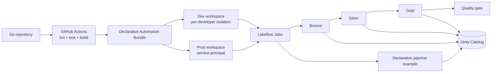

# Databricks CI/CD Learning Repository

This repository is a compact, end-to-end Databricks CI/CD reference. It turns the ideas
from the included [HTML guide](DBX_CI:CD.html) into a working project with a Python wheel,
unit tests, multiple Lakeflow Jobs, a declarative pipeline, three deployment targets,
Unity Catalog tables, and GitHub Actions automation.

> Databricks now calls Asset Bundles **Declarative Automation Bundles**. The
> `databricks bundle ...` commands remain unchanged.

## What this repository teaches

- How Python source code becomes a versioned wheel artifact.
- How to define jobs, task DAGs, compute, and schedules as code.
- How one bundle receives different dev, staging, and prod settings.
- How to separate non-sensitive parameters from secrets.
- How pull-request checks and automated deployments work together.
- When to use Lakeflow Jobs and when to use a declarative pipeline.

## Architecture



The main `medallion_job` contains this task DAG:

```text
bronze -> silver -> gold -> quality
```

- `bronze` writes seven deterministic records, including intentional invalid cases.
- `silver` filters invalid records and removes duplicates.
- `gold` aggregates orders by date and country.
- `quality` expects 3 valid orders and revenue of 175, failing the job on any mismatch.

See [docs/ARCHITECTURE.md](docs/ARCHITECTURE.md) for the design rationale.

## Repository map

```text
.
├── databricks.yml                    # Bundle, variables, and targets
├── resources/
│   ├── medallion_job.yml             # Four-step primary job
│   ├── report_job.yml                # Separate reporting job
│   ├── secret_example_job.yml        # Secret scope example
│   └── declarative_pipeline.yml      # Pipeline and its orchestrator job
├── src/dbx_cicd_sample/
│   ├── tasks/                        # Python wheel entry points
│   └── pipelines/                    # Declarative pipeline notebook source
├── tests/                            # Fast unit tests that require no Spark runtime
├── .github/workflows/                # CI, dev deployment, and prod deployment
└── docs/                             # Architecture, setup, CI/CD, and troubleshooting
```

## Prerequisites

- Python 3.10 or newer.
- The [uv](https://docs.astral.sh/uv/) package manager.
- Databricks CLI 0.275.0 or newer.
- A Databricks workspace with Unity Catalog enabled.
- An existing catalog in which the run identity can create schemas and tables.
- The `Standard_D4s_v5` node type on Azure, or an appropriate `node_type_id` override
  for another cloud.

## 1. Run local checks

```bash
uv sync --extra dev
make check
```

This runs formatting and lint checks, unit tests, the coverage gate, and a wheel build.
Neither Spark nor a Databricks connection is required.

Individual commands:

```bash
make lint
make test
make build
```

## 2. Authenticate to Databricks

Interactive OAuth login is recommended for local development:

```bash
databricks auth login \
  --host https://adb-0000000000000000.0.azuredatabricks.net \
  --profile dev
export DATABRICKS_CONFIG_PROFILE=dev
```

The repository stores neither a workspace host nor credentials. CI uses OIDC workload
identity federation, so it does not require a long-lived Databricks client secret.

## 3. Validate, deploy, and run in dev

Set your catalog and, if necessary, the compute node type:

```bash
export BUNDLE_VAR_catalog=main
export BUNDLE_VAR_node_type_id=Standard_D4s_v5

databricks bundle validate --target dev
databricks bundle deploy --target dev
databricks bundle summary --target dev
databricks bundle run --target dev medallion_job
```

Development mode automatically prefixes resources with the developer identity. The
schema also includes `${workspace.current_user.short_name}`, so two developers can
deploy this bundle into the same workspace without sharing tables or bundle resources.

After a successful run, look for these tables under `${BUNDLE_VAR_catalog}`:

- `dbx_cicd_<user>.bronze_orders`
- `dbx_cicd_<user>.silver_orders`
- `dbx_cicd_<user>.gold_daily_sales`

Run the separate reporting job after the primary job has created the Gold table:

```bash
databricks bundle run --target dev report_job
```

## 4. Override job parameters

A bundle variable is resolved at deployment time. A job parameter can also be
overridden for an individual run:

```bash
databricks bundle run --target dev medallion_job -- \
  --catalog=main \
  --schema=my_training_schema \
  --run_id=manual-001
```

Sensitive values do not belong in job parameters. Create the configured secret scope
and key before manually running the secret example:

```bash
databricks bundle run --target dev secret_example_job
```

The code logs only that the read succeeded and never prints the secret value. See
[docs/SETUP.md](docs/SETUP.md) for permissions and setup details.

## 5. Run the declarative pipeline example

`orders_declarative_pipeline` demonstrates the same medallion concept with declarative
tables and data quality expectations. A Lakeflow Job task starts the pipeline:

```bash
databricks bundle run --target dev pipeline_orchestrator_job
```

This is intentionally separate from the wheel-based workflow, allowing both execution
models to be compared within one bundle.

## 6. Environments

| Target | Mode | Run identity | Schedule | Typical trigger |
|---|---|---|---|---|
| `dev` | development | current developer or CI identity | paused | local or `develop` branch |
| `staging` | production guardrails | service principal | paused | manual release test |
| `prod` | production | service principal | daily at 06:00 | `main` branch with approval |

For staging and prod, pass the application ID rather than a secret:

```bash
export BUNDLE_VAR_service_principal_id=00000000-0000-0000-0000-000000000000
databricks bundle validate --target staging
```

Each target can use a different workspace because its host comes from the selected CLI
profile or CI environment. Separate dev and prod workspaces are recommended for real
production systems.

## 7. GitHub Actions

- `ci.yml` runs linting, unit tests, coverage, and wheel build for pull requests.
- `deploy-dev.yml` validates, deploys, and runs the primary job after a `develop` push.
- `deploy-prod.yml` deploys and smoke-tests after a `main` push and protected `prod`
  environment approval.

See [docs/CI_CD.md](docs/CI_CD.md) for the required GitHub Environment variables and
OIDC configuration.

## Cleanup

```bash
databricks bundle destroy --target dev
```

`bundle destroy` removes jobs and pipelines managed by the bundle. Tables created by
runtime code are not bundle resources and must be removed separately:

```sql
DROP SCHEMA IF EXISTS main.`dbx_cicd_<user>` CASCADE;
DROP SCHEMA IF EXISTS main.`dbx_cicd_pipeline_<user>` CASCADE;
```

## Suggested exercises

1. Change the sample data so that the quality task fails.
2. Add a task that runs only after `gold` succeeds.
3. Create an isolated deployment target for feature branches.
4. Replace classic job compute with a serverless job environment.
5. Add a staging release workflow before production.
6. Manage the schemas as explicit Unity Catalog bundle resources.

See [docs/TROUBLESHOOTING.md](docs/TROUBLESHOOTING.md) when a local or remote step fails.

